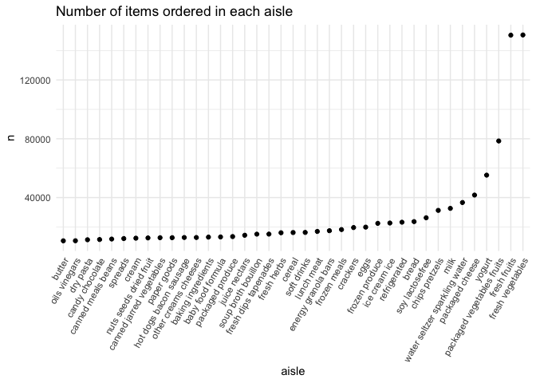
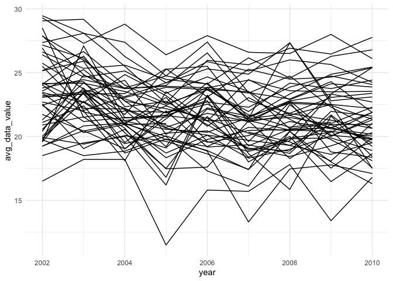
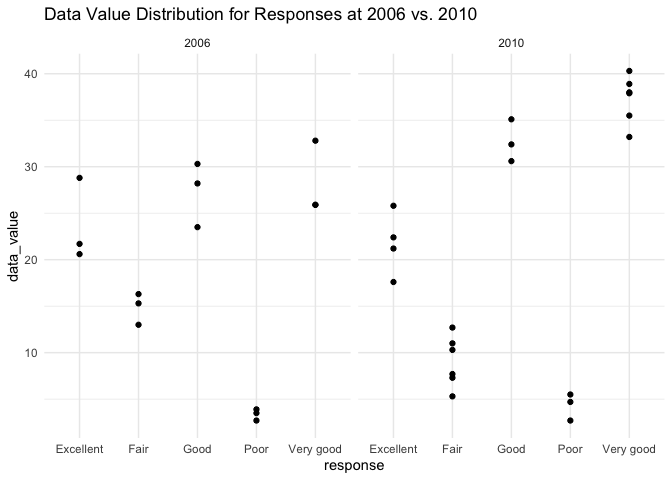

p8105_hw3_yz4720
================
Jasmine Zhang
2023-10-14

# Problem 1

``` r
data(instacart)
```

The `instacart` dataset contains 1384617 rows and 15 columns, and each
row represents an item from an order. The variables include order id,
product id, product name, number identifier of the item in the order,
whether the item is a reorder, and user id. There is also information on
the day and time of the order, and number of days since prior order,
location of the aisle and department with their corresponding id. In
total, there are 39123 products found in 131209 orders from 131209
distinct users.

``` r
instacart |> 
  count(aisle) |> 
  arrange(desc(n))
```

    ## # A tibble: 134 × 2
    ##    aisle                              n
    ##    <chr>                          <int>
    ##  1 fresh vegetables              150609
    ##  2 fresh fruits                  150473
    ##  3 packaged vegetables fruits     78493
    ##  4 yogurt                         55240
    ##  5 packaged cheese                41699
    ##  6 water seltzer sparkling water  36617
    ##  7 milk                           32644
    ##  8 chips pretzels                 31269
    ##  9 soy lactosefree                26240
    ## 10 bread                          23635
    ## # ℹ 124 more rows

There are 134 aisles in total. Most items are ordered from fresh
vegetables and fresh fruits aisles.

``` r
instacart |> 
  count(aisle) |> 
  filter(n>10000) |> 
  mutate(aisle = fct_reorder(aisle, n)) |>  
  ggplot(aes(x = aisle, y = n)) +
  geom_point() +
  labs(title = "Number of items ordered in each aisle") +
  theme(axis.text.x = element_text(angle = 60, hjust = 1))
```

<!-- -->

``` r
instacart |> 
  filter(aisle == c("baking ingredients", "dog food care", "packaged vegetables fruits")) |>
  group_by(aisle) |> 
  count(product_name) |> 
  mutate(rank = min_rank(desc(n))) |> 
  filter(rank < 4) |> 
  arrange(desc(n)) |>
  knitr::kable()
```

| aisle                      | product_name                                    |    n | rank |
|:---------------------------|:------------------------------------------------|-----:|-----:|
| packaged vegetables fruits | Organic Baby Spinach                            | 3324 |    1 |
| packaged vegetables fruits | Organic Raspberries                             | 1920 |    2 |
| packaged vegetables fruits | Organic Blueberries                             | 1692 |    3 |
| baking ingredients         | Light Brown Sugar                               |  157 |    1 |
| baking ingredients         | Pure Baking Soda                                |  140 |    2 |
| baking ingredients         | Organic Vanilla Extract                         |  122 |    3 |
| dog food care              | Organix Grain Free Chicken & Vegetable Dog Food |   14 |    1 |
| dog food care              | Organix Chicken & Brown Rice Recipe             |   13 |    2 |
| dog food care              | Original Dry Dog                                |    9 |    3 |

Make a table showing the mean hour of the day at which Pink Lady Apples
and Coffee Ice Cream are ordered on each day of the week; format this
table for human readers (i.e. produce a 2 x 7 table).

``` r
instacart |>
  filter(product_name %in% c("Pink Lady Apples", "Coffee Ice Cream")) |>
  group_by(product_name, order_dow) |>
  summarize(mean_hour = mean(order_hour_of_day)) |>
  pivot_wider(
    names_from = order_dow, 
    values_from = mean_hour) |>
  knitr::kable(digits = 2)
```

    ## `summarise()` has grouped output by 'product_name'. You can override using the
    ## `.groups` argument.

| product_name     |     0 |     1 |     2 |     3 |     4 |     5 |     6 |
|:-----------------|------:|------:|------:|------:|------:|------:|------:|
| Coffee Ice Cream | 13.77 | 14.32 | 15.38 | 15.32 | 15.22 | 12.26 | 13.83 |
| Pink Lady Apples | 13.44 | 11.36 | 11.70 | 14.25 | 11.55 | 12.78 | 11.94 |

# Problem 2

``` r
data("brfss_smart2010")
```

``` r
brfss_df = brfss_smart2010 |> 
  janitor::clean_names() |> 
  filter(topic == "Overall Health") |> 
  mutate(response = as.factor(response)) |> 
  mutate(response = fct_recode(response, 
                               "Poor" = "1", "Fair" = "2", "Good" = "3", "Very good" = "4", "Excellent" = "5"))
```

    ## Warning: There was 1 warning in `mutate()`.
    ## ℹ In argument: `response = fct_recode(...)`.
    ## Caused by warning:
    ## ! Unknown levels in `f`: 1, 2, 3, 4, 5

In 2002, which states were observed at 7 or more locations? What about
in 2010?

``` r
brfss_df |> 
  filter(year == "2002") |> 
  group_by(locationabbr) |> 
  summarize(obs_times = n_distinct(locationdesc)) |> 
  filter(obs_times >= 7)
```

    ## # A tibble: 6 × 2
    ##   locationabbr obs_times
    ##   <chr>            <int>
    ## 1 CT                   7
    ## 2 FL                   7
    ## 3 MA                   8
    ## 4 NC                   7
    ## 5 NJ                   8
    ## 6 PA                  10

``` r
brfss_df |> 
  filter(year == "2010") |> 
  group_by(locationabbr) |> 
  summarize(obs_times = n_distinct(locationdesc)) |> 
  filter(obs_times >= 7)
```

    ## # A tibble: 14 × 2
    ##    locationabbr obs_times
    ##    <chr>            <int>
    ##  1 CA                  12
    ##  2 CO                   7
    ##  3 FL                  41
    ##  4 MA                   9
    ##  5 MD                  12
    ##  6 NC                  12
    ##  7 NE                  10
    ##  8 NJ                  19
    ##  9 NY                   9
    ## 10 OH                   8
    ## 11 PA                   7
    ## 12 SC                   7
    ## 13 TX                  16
    ## 14 WA                  10

In the year 2002, CT, FL, MA, NC, NJ, and PA were observed at 7 or more
locations. In 2010, CA, CO, FL, MA, MD, NC, NE, NJ, NY, and OH were
observed at 7 or more locations.

Construct a dataset that is limited to Excellent responses, and
contains, year, state, and a variable that averages the data_value
across locations within a state. Make a “spaghetti” plot of this average
value over time within a state (that is, make a plot showing a line for
each state across years – the geom_line geometry and group aesthetic
will help).

``` r
brfss_excellent = brfss_df |> 
  filter(response == "Excellent") |> 
  select(year, locationabbr, data_value) |> 
  group_by(year, locationabbr) |> 
  summarize(avg_data_value = mean(data_value)) 
```

    ## `summarise()` has grouped output by 'year'. You can override using the
    ## `.groups` argument.

``` r
ggplot(brfss_excellent, 
       aes(x = year, y = avg_data_value, 
           group = locationabbr)) +
  geom_line()
```

    ## Warning: Removed 3 rows containing missing values (`geom_line()`).

<!-- -->

Make a two-panel plot showing, for the years 2006, and 2010,
distribution of data_value for responses (“Poor” to “Excellent”) among
locations in NY State.

``` r
brfss_df |> 
  filter(year == c("2006", "2010")) |> 
  filter(locationabbr == "NY") |> 
  ggplot(aes(x = response, y = data_value)) +
  geom_point() +
  facet_wrap(~year) +
  labs(title = "Data Value Distribution for Responses at 2006 vs. 2010")
```

    ## Warning: There was 1 warning in `filter()`.
    ## ℹ In argument: `year == c("2006", "2010")`.
    ## Caused by warning in `year == c("2006", "2010")`:
    ## ! longer object length is not a multiple of shorter object length

<!-- -->
